# MediaLogger

MediaLogger is a full-stack media tracking application for organizing movies, TV shows, games, and books in one personal library. Users can search external media databases, view details, mark items as completed or planned, save favorites, and review collection statistics.

# Features

• Account registration, login, and JWT authentication

• Separate collections for movies, TV shows, games, and books

• Search and detailed media information

• Watched/read/played and watchlist/reading-list statuses

• Favorites and profile statistics

• Responsive web interface and Android app

#   Screenshots

  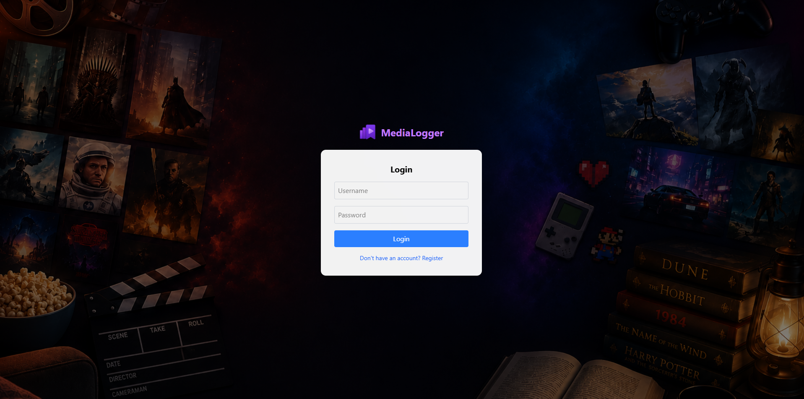
  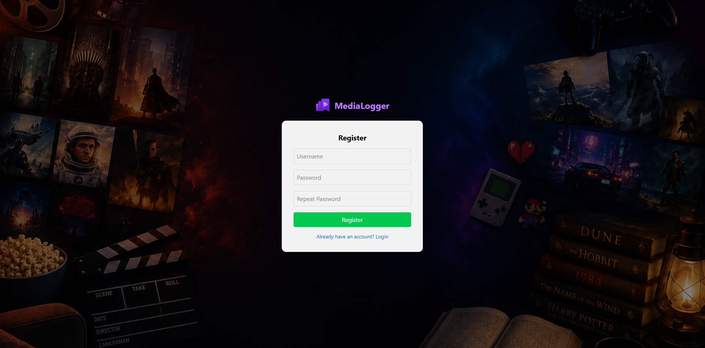
  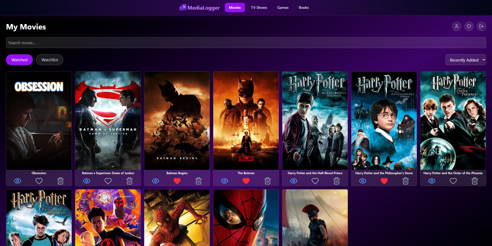
  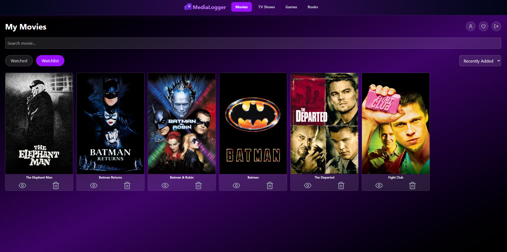
  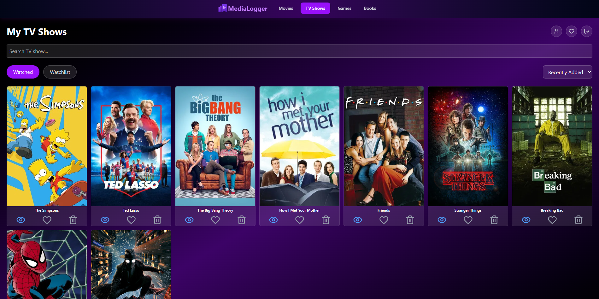
  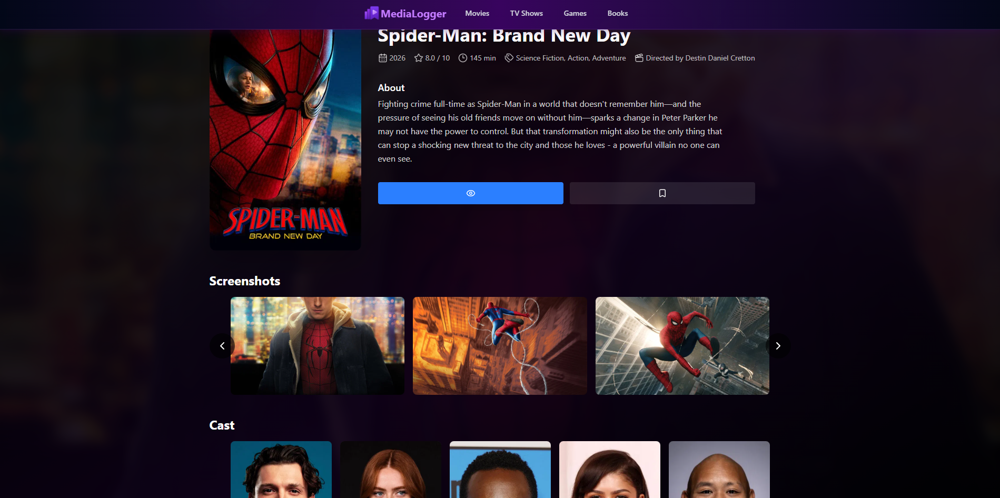
  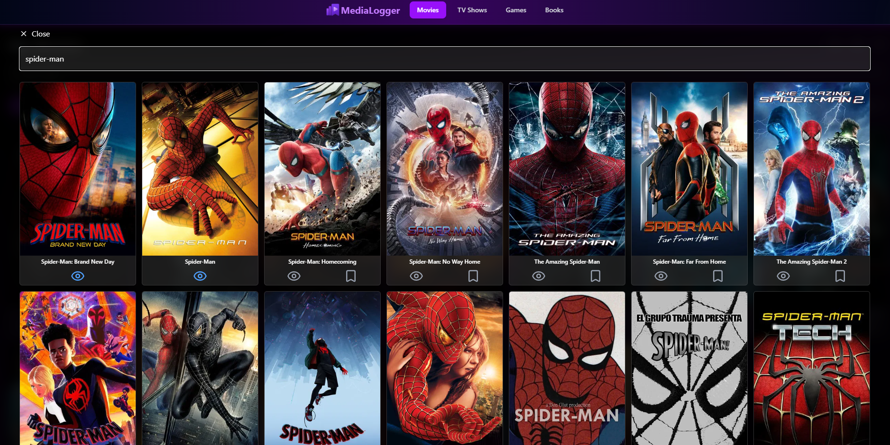
  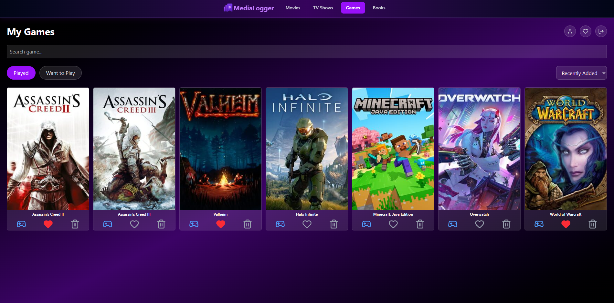
  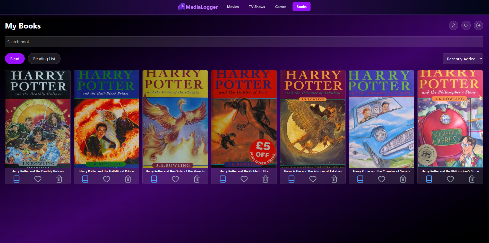
  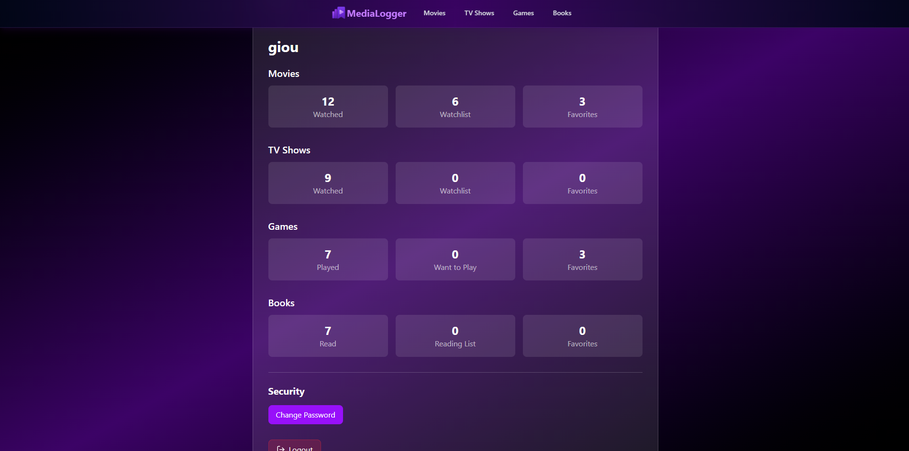
  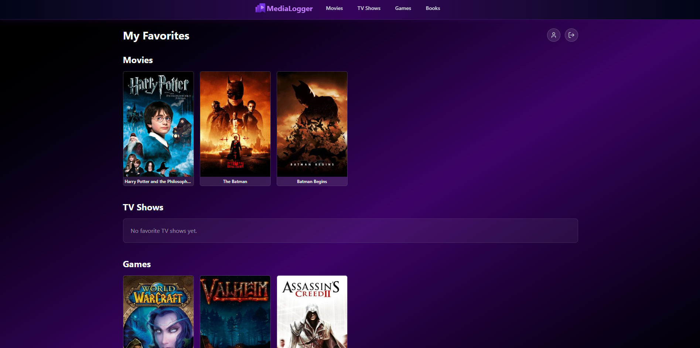

# Tech Stack

• Frontend: React, Vite, Tailwind CSS, Axios

• Backend: Node.js, Express, Prisma

• Database: PostgreSQL

• External data: TMDB, IGDB, Open Library

• Android: Capacitor

• Deployment: Vercel

# How It Works

The React frontend sends requests to the Express API. The backend handles authentication and stores each user's library in PostgreSQL through Prisma. Media information is retrieved from TMDB for movies and TV shows, IGDB for games, and Open Library for books. The Android version packages the same frontend with Capacitor and connects to the deployed API.

Use the Deployed Versions

• Web app: https://media-logger-iota.vercel.app/

• Android APK: Download the latest APK from the repository's Releases page.

Android may ask you to allow installation from unknown sources when installing the APK directly.

• Run Locally with Docker

1. Clone the repository

    git clone https://github.com/XrisafisGiou/MediaLogger.git
    cd MediaLogger

2. Edit .env.docker in the project root with your own keys

    TMDB credentials are used for movies and TV shows. Twitch developer credentials are required for IGDB game data. Open Library does not require an API key.

3. Start the application

    docker compose up --build

    Open:

    Frontend: http://localhost:5173

    Backend: http://localhost:3000

    Database migrations are applied automatically when the backend container starts.